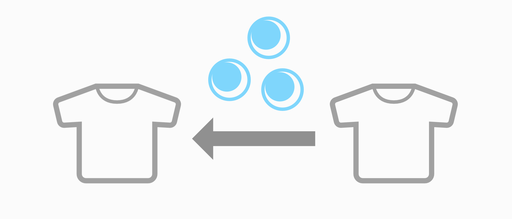

# Material Assignment Transfer

[VCCに追加]()

同じ名前のメッシュのマテリアル割り当てを一括でコピーするツールです。主にVRChatのアバター改変や衣装製作で役に立ちます。

※マテリアル**割り当て**をコピーする（マテリアルの差し替えを自動化する）ツールです。マテリアル自体のコピーや変更は行いません。

## こんな経験はないでしょうか？

非対応衣装を手動あるいはツールで着せた。小物の出し入れギミックも追加した。PhysBoneも調整して、軽量化して、全部済んだその後で・・・ **やっぱり他の色も試したくなった！！**

こんなときどうしますか？ツールで再変換するのは時間がかかりますし、手でマテリアルを差し替えるのも装飾の多い衣装では面倒です。

Material Assignment Transferはそんなときに役に立つツールです。

衣装製作者であれば、あるアバター向けに作ったカラバリのマテリアル割り当てを他のアバターに転用するのにも役立ちます。

## 使い方

1. Tools > sitorasu's tools > Material Assignment Transfer を開きます。
1. コピー元の衣装を指定します。
1. ターゲットの衣装を指定します。
1. 実行計画を確認します。緑のマテリアルが実行前後の差分です。
1. 実行ボタンを押します。ターゲットのマテリアルが差し替えられます。

動画でも手順を確認できます。

https://github.com/user-attachments/assets/3dcc15bc-a8e1-43a4-8a30-14af76160d33

例として[HeartAttack_official](https://momijinokaede.booth.pm/)様の[Teddy Syndrome](https://momijinokaede.booth.pm/items/8127985)を使用させていただきました。

## 類似ツールとの違い

類似ツールとして[Material Copier](https://kxn4t.github.io/kanameliser-editor-plus/features/material-copier)があります。Material Copierはパス情報を用いたマッチングに優れており、類似名マッチもサポートしています。Material Assignment Transferは階層を考慮せず名前の完全一致だけでマッチングしますが、候補が複数ある場合にRendererの種類、マテリアルスロットの数、メッシュの頂点数に基づいて候補を選択するという特長があります。状況に応じて使い分けてみてください。

## 動作の詳細

- コピー元とターゲットの配下にあるRendererをすべて取得し、ターゲット側の各Rendererについて、コピー元に同じ名前のRendererが存在するならばそのRendererのマテリアル割り当てをターゲット側にコピーします。
- ただし同じ名前のRendererがあっても以下の場合はコピーを行いません。
  - Rendererの種類（SkinnedMeshRenderer/MeshRenderer）が異なる。
  - 紐づいたメッシュのサブメッシュ（≒マテリアルスロット）の数が異なる。
- 上記のコピーを行わない条件を踏まえても候補のRendererが複数ある場合はメッシュの頂点数が最も近いものを選択します。
- 「マテリアルスロットの対応付け方式」はコピー元の何番目のマテリアルをターゲットの何番目のマテリアルに割り当てるかを決めるルールです。
  - インデックス：単純に番号通りに割り当てます。基本的にこれで事足ります。
  - サブメッシュの頂点数：マテリアルスロットを頂点数の多さで順位付けし、同じ順位のマテリアルを割り当てます。コピー元とターゲットでマテリアルスロットの順番が一致していない場合にこれを使うとうまくいく可能性があります。初期のもちふぃった～では変換後にマテリアルスロットの順番が入れ替わることがあったためそれに対応するために実装しました（現在は順番が維持されるよう改善されています）。

## 自分用メモ

リリースの仕方

1. `package.json`の`version`を更新する。
1. 更新後のバージョンと同じ文字列（vプレフィックスは不要）のタグをリリース用のコミットに付ける。
1. GitHub Actionsの`Build unitypackage`ワークフローを開始する。
